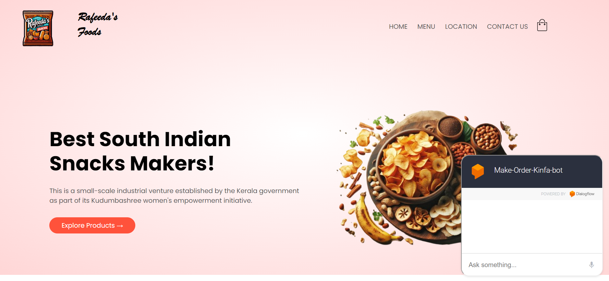
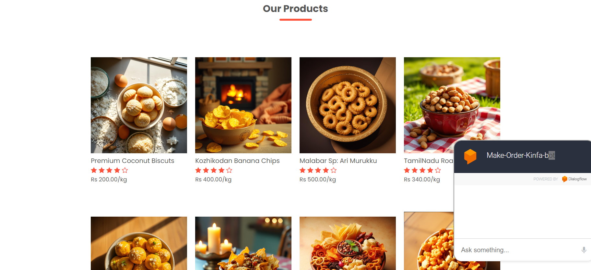

# AI Chat Bot using Dialogflow - End to End NLP Project

## Scope of Work (SOW)
This chat bot will help to,
* Create new order
* Track the order
## Chatbot Plantform Selection
* Dialogflow

## Dialogflow's Intent Classification Model
* Dialogflow employs a hybrid approach for intent classification, combining rule-based matching with machine learning.
* This combination allows for robust and accurate intent detection across various scenarios.
   
Key Components of Dialogflow's Intent Classification:

### Rule-Based Matching:
* This method uses predefined patterns and grammars to directly match user input with specific intents.
* It's efficient for simple and well-defined intents.

### Machine Learning:
* Dialogflow utilizes advanced machine learning models, likely including variations of neural networks, to analyze user input and classify intents based on learned patterns.
* This approach is particularly effective for handling complex and ambiguous user utterances.

### How It Works:
* Dialogflow simultaneously applies both rule-based and machine learning models to a given user input.   
* The system then compares the results from both methods and selects the intent with the highest confidence score.   
* This hybrid approach enhances the overall accuracy and robustness of intent classification.